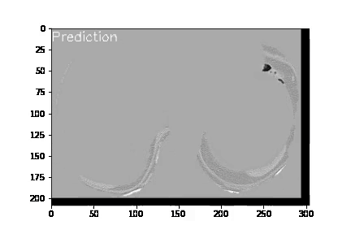

# Lung Cancer Detection, Segmentation, and 3D Reconstruction
## Overview

This project aims to develop a three-step pipeline for detecting lung nodules, segmenting and 3D reconstructing them. The pipeline includes:

1. Detection: Identifying lung nodules in medical imaging scans
2. Segmentation: Isolating and outlining the detected nodules
3. 3D Reconstruction: Creating a three-dimensional model of the nodules for analysis

The solution employs 3D-CNN and multi-task learning to achieve high accuracy in both classification and segmentation. The model is then used to analyze the nodules for signs of malignancy, such as irregular shape or size.

## Background
Lung cancer detection and diagnosis remains a significant challenge in the medical field. Early detection is crucial for successful treatment, but the identification of lung nodules, small growths on the lung tissue, can be difficult due to their size and location. Computed tomography (CT) scans are commonly used for detecting lung nodules, but manually identifying these nodules in CT scans can be a lengthy and laborious process for radiologists. Accurate and precise segmentation of nodules can provide more detailed information about their shape, size, and rate of change, which can be useful for diagnosis and treatment planning.

## Approach
We explore various network architectures and parameters for lung cancer detection, segmentation, and 3D reconstruction. We use 3D CNNs and multi-task learning approaches for the detection and segmentation of lung nodules, which have shown improved performance over traditional methods. We also use techniques such as multi-task learning, transfer learning, and ensemble learning to improve the accuracy and robustness of these models.

## Data and Experiment Configuration
The data used for these experiments is the [LUNA16](https://luna16.grand-challenge.org) dataset, which is a public dataset of CT scans used for the evaluation of computer-aided detection and diagnosis of lung cancer. The dataset was created by the National Cancer Institute and the LIDC-IDRI as part of a series of challenges.

## Results
Our final results developed in our project are an extension of the work developed by the NoduleNet team at University of California Irvine, specifically in the areas of prediction post-processing and visualization. To achieve this, we made minor adjustments and developed python scripts to be integrated into the NoduleNet codebase, which allowed the model to work seamlessly on our machine. These modifications were necessary to ensure that the model was optimized for our specific dataset and computing resources.
Conclusion

### NoduleNet:

  

### 3D Visualization:

The combination of these three steps allows for the accurate and efficient identification of lung nodules and the determination of their potential risk to the patient. This pipeline can be used to aid radiologists in the detection and diagnosis of lung cancer.

## How to Run:
1. `cd NoduleNet/`
2. Follow the instructions on how to run the `NoduleNet` (details can be found in the repository above)
    - After evaluating, results are generated in `./NoduleNet/results/cross_val_test/res/200/`
3. run `generate_contours.py`, will generate 2D contours 
    - This will only generate contours for only 1 patient.
4. run `3d_nodule_viz.py` 
    - Run through conda command prompt for interactive interface.

## Author
Bardh Rushiti {br3004@rit.edu}

## Mentor
Dr. Zachary Butler {zxbvcs@rit.edu}

### Reference Paper 
Summary of the project, and useful references can be found [here](https://drive.google.com/file/d/1nlt2NdHwGUiQ_x-1aPKp9ldt8SCrqCha/view?usp=sharing).
